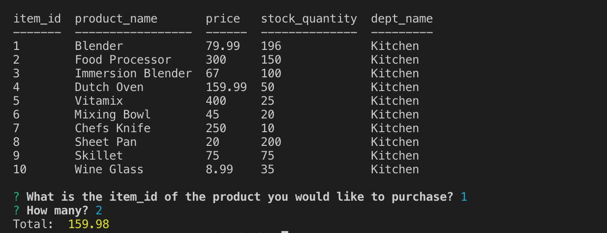
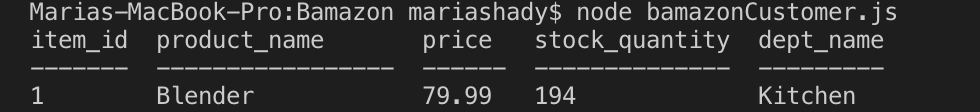
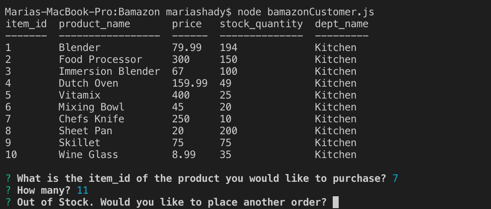

# Bamazon
* For: UNH Portsmouth Coding Bootcamp
* Student: Maria Shady
* Built with: Nodejs, JavaScript, MySQL

# Description
This application mocks the Amazon store.  When you run the application it will display a table with 'item_id', 'product_name', 'price', 'stock_quantity', and 'dept_name'.

The application will then ask the user 2 questions:
1. What is the item_id of the product you would like to purchase?
2. How many?

If the item is in stock the application will display the total that the user must pay and 'stock_quantity' will be updated. If the order cannot be fulfilled (i.e. there is not enough stock in inventory) the user will be notified and asked if they would like to place another order. If yes, the application will start over. 

Please see images below:

In this image you will see a table of available items, the user purchased 2 Blenders:

In this image you will see that the 'stock_quantity' for the blender has been updated from 196 to 194 

In this image you will see that the user wanted to purchase 11 Chef's Knives, however there are not enough in stock.  The user is notified and asked if they would like to place another order:

